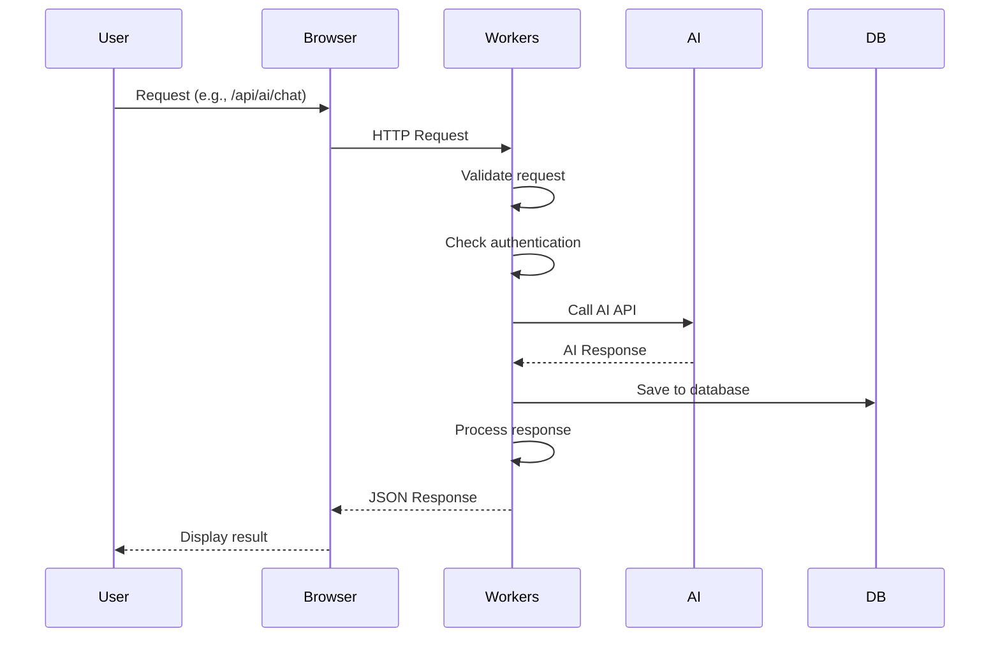
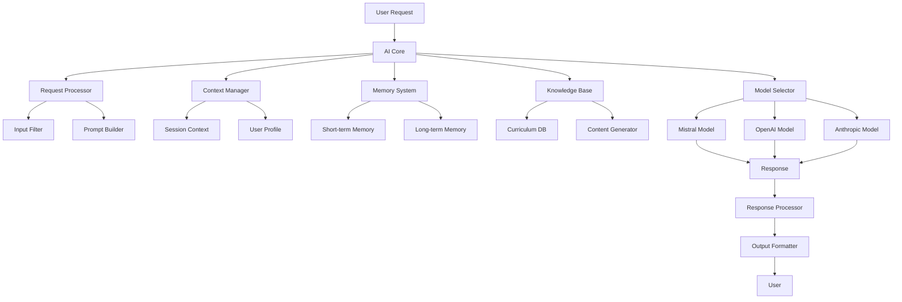
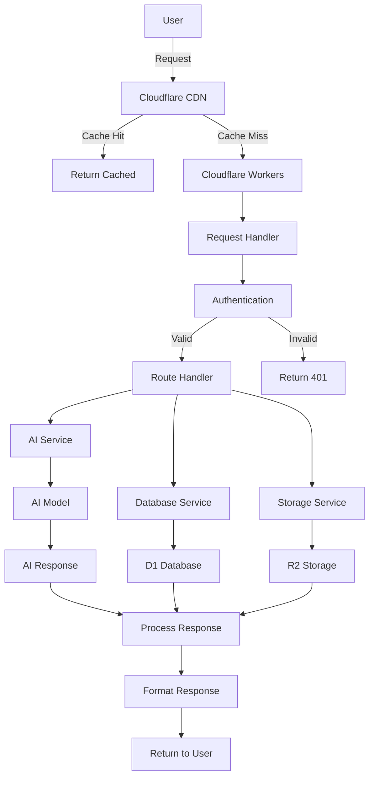
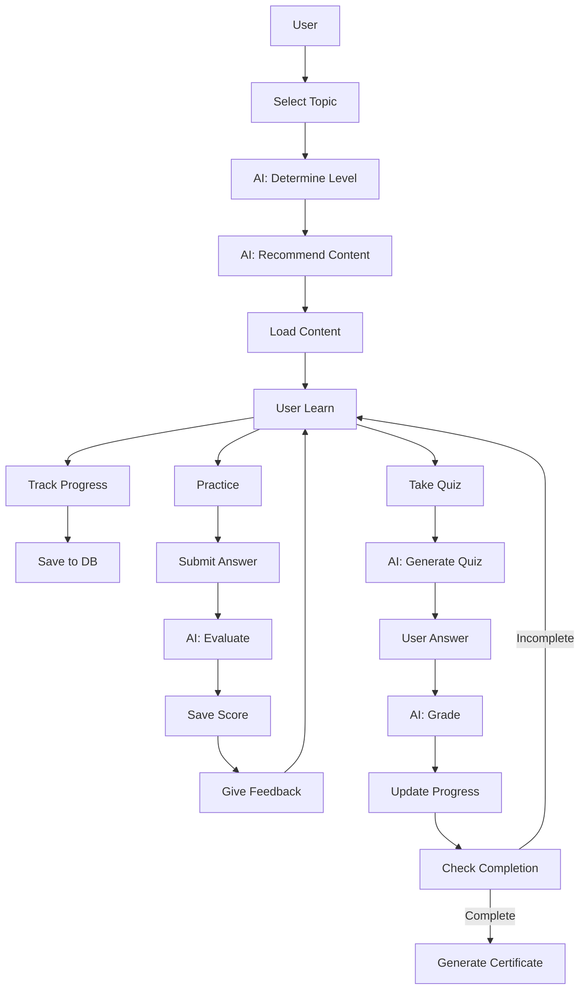
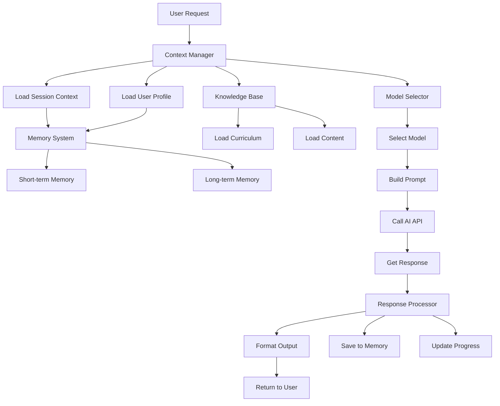
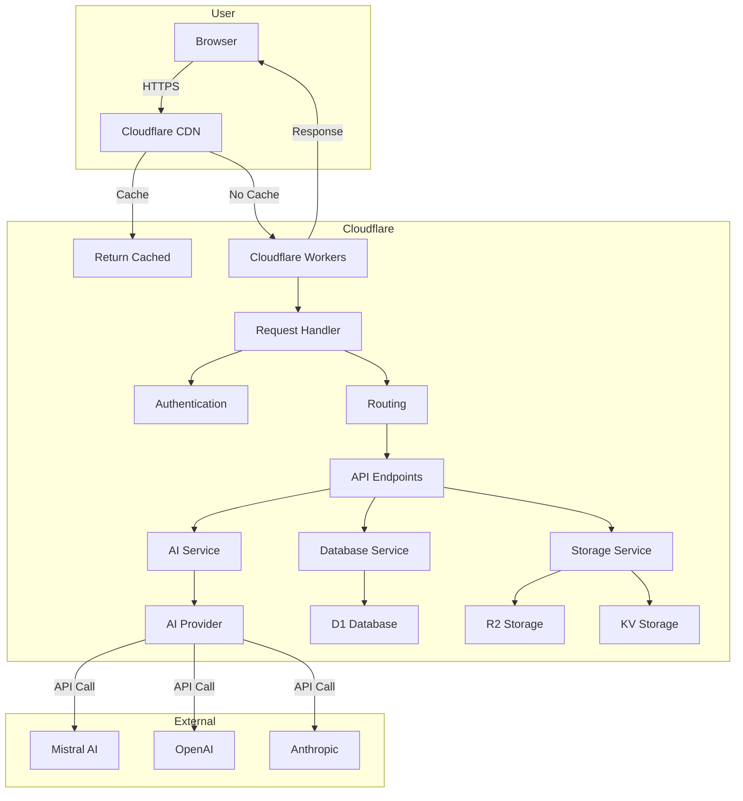
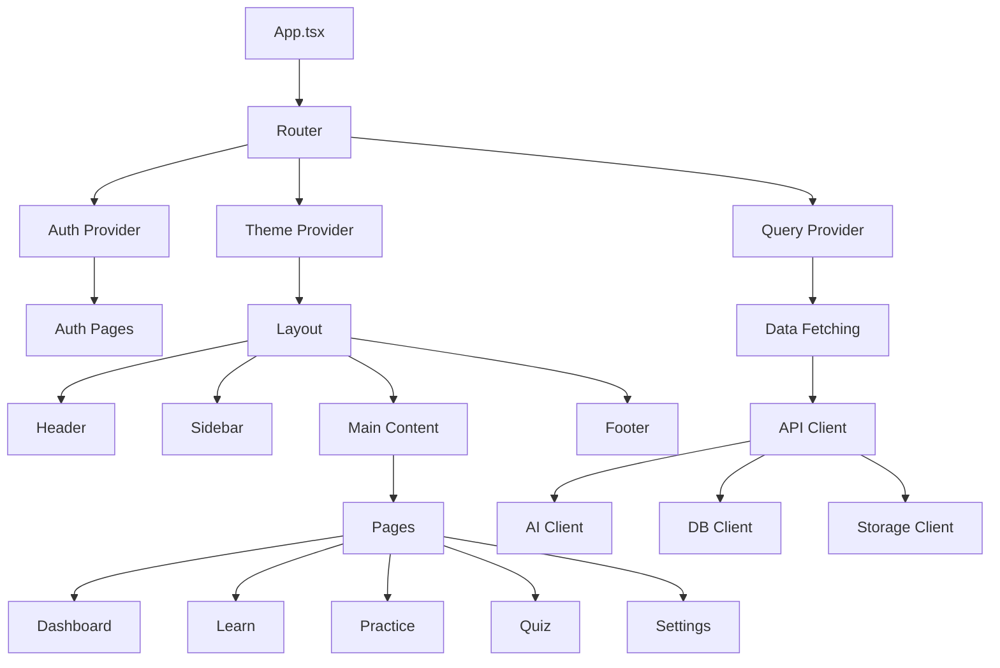

# Learner AI - Architecture

**Versi:** 1.0.0 | **Tanggal:** 26 Juli 2026 | **Developer:** HidayatBelajar319

---

## 📋 Daftar Isi

1. [Ringkasan Arsitektur](#ringkasan-arsitektur)
2. [Arsitektur Frontend](#arsitektur-frontend)
3. [Arsitektur Backend](#arsitektur-backend)
4. [Arsitektur AI](#arsitektur-ai)
5. [Arsitektur Database](#arsitektur-database)
6. [Arsitektur Storage](#arsitektur-storage)
7. [Alur Data](#alur-data)
8. [Diagram Arsitektur](#diagram-arsitektur)
9. [Integrasi Sistem](#integrasi-sistem)

---

## 🏗️ Ringkasan Arsitektur <a id="ringkasan-arsitektur"></a>

Learner AI menggunakan arsitektur **modern, scalable, dan serverless** berbasis Cloudflare Workers dengan integrasi AI yang kuat.

### Teknologi Utama


| Lapisan      | Teknologi                    | Fungsi            |
| ------------ | ---------------------------- | ----------------- |
| **Frontend** | React + Next.js + TypeScript | UI &amp; UX       |
| **Backend**  | Cloudflare Workers           | Logic &amp; API   |
| **AI**       | Mistral/OpenAI/Anthropic     | Inteligensia      |
| **Database** | Cloudflare D1 (SQLite)       | Penyimpanan data  |
| **Storage**  | Cloudflare R2                | Penyimpanan file  |
| **Cache**    | Cloudflare KV                | Penyimpanan cache |


### Keunggulan Arsitektur

- **Serverless:** Tidak perlu manage server
- **Edge Computing:** Proses di edge (lebih cepat)
- **Scalable:** Otomatis scale sesuai kebutuhan
- **Cost-effective:** Bayar per usage
- **Global:** CDN Cloudflare (akses cepat di seluruh dunia)

---

## 🖥️ Arsitektur Frontend <a id="arsitektur-frontend"></a>

### Struktur

```
src/
├── components/      # React components
│   ├── common/     # Common components (Button, Input, Card)
│   ├── layout/     # Layout (Header, Sidebar, Footer)
│   ├── ui/         # UI (Modal, Toast, Tooltip)
│   └── learning/   # Learning-specific components
│
├── pages/          # Pages/Route
│   ├── auth/       # Authentication (Login, Register)
│   ├── dashboard/  # Dashboard
│   ├── learn/      # Learning pages
│   ├── practice/   # Practice pages
│   ├── quiz/       # Quiz pages
│   └── settings/   # Settings
│
├── contexts/       # React contexts
├── hooks/          # Custom hooks
├── lib/            # Utilities
├── styles/         # CSS/Styles
├── types/          # TypeScript types
├── App.tsx         # Main App
└── index.ts        # Entry point
```

### Framework &amp; Library


| Komponen          | Teknologi           | Fungsi              |
| ----------------- | ------------------- | ------------------- |
| **Framework**     | Next.js             | React framework     |
| **UI Library**    | Headless UI + Radix | Komponen UI         |
| **Styling**       | Tailwind CSS        | CSS framework       |
| **Animasi**       | Framer Motion       | Animasi             |
| **State**         | Zustand             | State management    |
| **Data Fetching** | React Query         | Data fetching       |
| **Routing**       | React Router        | Client-side routing |
| **Editor**        | Monaco Editor       | Code editor         |
| **Diagram**       | Mermaid             | Diagram rendering   |
| **Charts**        | Chart.js + D3.js    | Visualisasi data    |


### Fitur Frontend

- **Responsive Design:** Mobile, Tablet, Desktop
- **Dark Mode:** Mode gelap
- **Accessibility:** WCAG 2.1 AA
- **Performance:** Lazy loading, code splitting
- **SEO:** SEO-friendly

---

## 🖥️ Arsitektur Backend <a id="arsitektur-backend"></a>

### Cloudflare Workers

```
src/
├── api/             # API endpoints
│   ├── ai/          # AI endpoints
│   │   ├── chat.ts  # Chat endpoint
│   │   ├── code.ts  # Code endpoint
│   │   └── ...
│   │
│   ├── auth/        # Authentication
│   │   ├── login.ts
│   │   ├── register.ts
│   │   └── ...
│   │
│   ├── content/     # Content management
│   │   ├── subjects.ts
│   │   ├── languages.ts
│   │   └── ...
│   │
│   ├── learning/    # Learning system
│   │   ├── progress.ts
│   │   ├── sessions.ts
│   │   └── ...
│   │
│   ├── evaluation/  # Evaluation system
│   │   ├── quiz.ts
│   │   ├── exam.ts
│   │   └── ...
│   │
│   └── utils/      # Utilities
│
└── index.ts        # Main handler
```

### Endpoints Utama


| Endpoint                 | Method | Deskripsi             |
| ------------------------ | ------ | --------------------- |
| `/api/ai/chat`           | POST   | Chat dengan AI        |
| `/api/ai/code`           | POST   | Generate code         |
| `/api/ai/explain`        | POST   | Jelaskan konsep       |
| `/api/auth/login`        | POST   | Login                 |
| `/api/auth/register`     | POST   | Register              |
| `/api/content/subjects`  | GET    | Daftar mata pelajaran |
| `/api/content/topics`    | GET    | Daftar topik          |
| `/api/learning/progress` | GET    | Kemajuan belajar      |
| `/api/evaluation/quiz`   | POST   | Mulai quiz            |
| `/api/evaluation/submit` | POST   | Submit jawaban        |


### Request Flow



---

## 🤖 Arsitektur AI <a id="arsitektur-ai"></a>

### Sistem AI



### Komponen AI


| Komponen               | Deskripsi          | Teknologi      |
| ---------------------- | ------------------ | -------------- |
| **AI Core**            | Inteligensia utama | TypeScript     |
| **Context Manager**    | Mengelola konteks  | TypeScript     |
| **Memory System**      | Penyimpanan memori | KV + Vector DB |
| **Knowledge Base**     | Basis pengetahuan  | D1 Database    |
| **Model Selector**     | Pilih model AI     | TypeScript     |
| **Request Processor**  | Proses request     | TypeScript     |
| **Response Processor** | Proses response    | TypeScript     |


### Model AI yang Digunakan


| Provider      | Model                 | Kegunaan       |
| ------------- | --------------------- | -------------- |
| **Mistral**   | mistral-tiny-latest   | NLP dasar      |
| **Mistral**   | mistral-small-latest  | NLP standar    |
| **Mistral**   | mistral-medium-latest | NLP advanced   |
| **Mistral**   | codestral-latest      | Coding         |
| **OpenAI**    | gpt-3.5-turbo         | NLP alternatif |
| **OpenAI**    | gpt-4                 | NLP premium    |
| **Anthropic** | haiku                 | NLP cepat      |
| **Anthropic** | sonnet                | NLP seimbang   |
| **Anthropic** | opus                  | NLP terbaik    |


### Integrasi AI

- **Natural Language:** Pemahaman &amp; generasi teks
- **Code Generation:** Pembuatan kode pemrograman
- **Content Generation:** Pembuatan materi pembelajaran
- **Evaluation:** Pembuatan quiz &amp; ujian
- **Personalization:** Rekomendasi &amp; adaptasi

---

## 🗃️ Arsitektur Database <a id="arsitektur-database"></a>

### Cloudflare D1 (SQLite)

```sql
-- Users
CREATE TABLE users (
    id TEXT PRIMARY KEY,
    email TEXT UNIQUE NOT NULL,
    username TEXT UNIQUE NOT NULL,
    password_hash TEXT NOT NULL,
    profile TEXT,
    preferences TEXT,
    created_at TEXT NOT NULL,
    updated_at TEXT NOT NULL
);

-- Learning Sessions
CREATE TABLE learning_sessions (
    id TEXT PRIMARY KEY,
    user_id TEXT NOT NULL,
    subject TEXT NOT NULL,
    topic TEXT NOT NULL,
    level TEXT NOT NULL,
    status TEXT NOT NULL DEFAULT 'active',
    progress REAL NOT NULL DEFAULT 0,
    started_at TEXT NOT NULL,
    ended_at TEXT,
    FOREIGN KEY (user_id) REFERENCES users(id)
);

-- Learning History
CREATE TABLE learning_history (
    id TEXT PRIMARY KEY,
    user_id TEXT NOT NULL,
    session_id TEXT,
    activity_type TEXT NOT NULL,
    content_id TEXT,
    duration INTEGER NOT NULL DEFAULT 0,
    score REAL,
    completed_at TEXT NOT NULL,
    FOREIGN KEY (user_id) REFERENCES users(id),
    FOREIGN KEY (session_id) REFERENCES learning_sessions(id)
);

-- Content
CREATE TABLE content (
    id TEXT PRIMARY KEY,
    title TEXT NOT NULL,
    subject TEXT NOT NULL,
    topic TEXT NOT NULL,
    level TEXT NOT NULL,
    type TEXT NOT NULL,
    format TEXT NOT NULL,
    data TEXT,
    metadata TEXT,
    created_at TEXT NOT NULL,
    updated_at TEXT NOT NULL
);

-- Quizzes
CREATE TABLE quizzes (
    id TEXT PRIMARY KEY,
    title TEXT NOT NULL,
    subject TEXT NOT NULL,
    topic TEXT NOT NULL,
    level TEXT NOT NULL,
    questions TEXT NOT NULL,
    created_at TEXT NOT NULL,
    updated_at TEXT NOT NULL
);

-- User Progress
CREATE TABLE user_progress (
    id TEXT PRIMARY KEY,
    user_id TEXT NOT NULL,
    content_id TEXT NOT NULL,
    progress REAL NOT NULL DEFAULT 0,
    score REAL,
    last_accessed TEXT NOT NULL,
    FOREIGN KEY (user_id) REFERENCES users(id),
    FOREIGN KEY (content_id) REFERENCES content(id)
);

-- XP & Level
CREATE TABLE user_xp (
    id TEXT PRIMARY KEY,
    user_id TEXT NOT NULL UNIQUE,
    total_xp INTEGER NOT NULL DEFAULT 0,
    level INTEGER NOT NULL DEFAULT 1,
    last_updated TEXT NOT NULL,
    FOREIGN KEY (user_id) REFERENCES users(id)
);

-- Streaks
CREATE TABLE user_streaks (
    id TEXT PRIMARY KEY,
    user_id TEXT NOT NULL UNIQUE,
    current_streak INTEGER NOT NULL DEFAULT 0,
    longest_streak INTEGER NOT NULL DEFAULT 0,
    last_login TEXT NOT NULL,
    FOREIGN KEY (user_id) REFERENCES users(id)
);

-- Achievements
CREATE TABLE achievements (
    id TEXT PRIMARY KEY,
    user_id TEXT NOT NULL,
    type TEXT NOT NULL,
    title TEXT NOT NULL,
    description TEXT,
    earned_at TEXT NOT NULL,
    FOREIGN KEY (user_id) REFERENCES users(id)
);

-- Badges
CREATE TABLE badges (
    id TEXT PRIMARY KEY,
    user_id TEXT NOT NULL,
    badge_id TEXT NOT NULL,
    earned_at TEXT NOT NULL,
    FOREIGN KEY (user_id) REFERENCES users(id)
);

-- Certificates
CREATE TABLE certificates (
    id TEXT PRIMARY KEY,
    user_id TEXT NOT NULL,
    type TEXT NOT NULL,
    title TEXT NOT NULL,
    data TEXT NOT NULL,
    issued_at TEXT NOT NULL,
    FOREIGN KEY (user_id) REFERENCES users(id)
);
```

### Index yang Diperlukan

```sql
-- Index untuk performa
CREATE INDEX idx_users_email ON users(email);
CREATE INDEX idx_users_username ON users(username);
CREATE INDEX idx_learning_sessions_user ON learning_sessions(user_id);
CREATE INDEX idx_learning_sessions_subject ON learning_sessions(subject);
CREATE INDEX idx_learning_history_user ON learning_history(user_id);
CREATE INDEX idx_learning_history_session ON learning_history(session_id);
CREATE INDEX idx_content_subject ON content(subject);
CREATE INDEX idx_content_topic ON content(topic);
CREATE INDEX idx_content_level ON content(level);
CREATE INDEX idx_user_progress_user ON user_progress(user_id);
CREATE INDEX idx_user_progress_content ON user_progress(content_id);
```

---

## 💾 Arsitektur Storage <a id="arsitektur-storage"></a>

### Cloudflare R2 (Object Storage)

```
learner-storage/
├── content/                    # Konten pembelajaran
│   ├── subjects/              # Mata pelajaran
│   │   ├── mathematics/       # Matematika
│   │   │   ├── algebra/      # Aljabar
│   │   │   │   ├── basic/    # Dasar
│   │   │   │   │   ├── theory.md
│   │   │   │   │   ├── examples.md
│   │   │   │   │   └── ...
│   │   │   │   └── ...
│   │   │   └── ...
│   │   └── ...
│   │
│   ├── languages/             # Bahasa
│   │   ├── english/          # Bahasa Inggris
│   │   │   ├── vocabulary/
│   │   │   ├── grammar/
│   │   │   └── ...
│   │   └── ...
│   │
│   ├── programming/           # Pemrograman
│   │   ├── python/
│   │   ├── javascript/
│   │   └── ...
│   │
│   └── skills/               # Keterampilan
│       ├── business/
│       └── ...
│
├── users/                     # Data pengguna
│   └── {user_id}/
│       ├── uploads/          # Upload pengguna
│       ├── projects/         # Proyek pengguna
│       └── certificates/     # Sertifikat pengguna
│
└── static/                    # Assets statis
    ├── images/               # Gambar
    ├── icons/                # Icon
    ├── fonts/                # Font
    └── documents/            # Dokumen
```

### Cloudflare KV (Key-Value Storage)


| Binding           | Kegunaan          | TTL    |
| ----------------- | ----------------- | ------ |
| `LEARNER_KV`      | Cache AI response | 1 jam  |
| `LEARNER_SESSION` | Session storage   | 24 jam |
| `LEARNER_CACHE`   | Cache umum        | 1 hari |


---

## 🔄 Alur Data <a id="alur-data"></a>

### Alur Utama



### Alur Pembelajaran



### Alur AI



---

## 🔗 Diagram Arsitektur <a id="diagram-arsitektur"></a>

### Arsitektur Keseluruhan



### Arsitektur Frontend



---

## 🔗 Integrasi Sistem <a id="integrasi-sistem"></a>

### Integrasi Frontend-Backend

- **HTTP Request:** Fetch API
- **WebSockets:** Real-time communication (jika diperlukan)
- **Server-Sent Events:** Streaming response AI

### Integrasi Backend-AI

- **REST API:** Mistral/OpenAI/Anthropic
- **Streaming:** Streaming response
- **Caching:** Cache response AI
- **Fallback:** Fallback ke provider lain jika gagal

### Integrasi Backend-Database

- **D1 Client:** Cloudflare D1
- **Query Builder:** SQL query
- **ORM:** Simple ORM (jika diperlukan)
- **Migration:** Database migration

### Integrasi Backend-Storage

- **R2 Client:** Cloudflare R2
- **Upload Handler:** File upload
- **Download Handler:** File download
- **File Management:** Manajemen file

---

## 📝 Catatan

- **Serverless:** Semua backend berjalan di Cloudflare Workers
- **Edge:** Proses di edge location (lebih cepat)
- **Scalable:** Otomatis scale sesuai kebutuhan
- **Cost-effective:** Bayar per request/usage
- **Global:** CDN Cloudflare (akses cepat di seluruh dunia)

---

*Dokumen terakhir diperbarui: 26 Juli 2026*