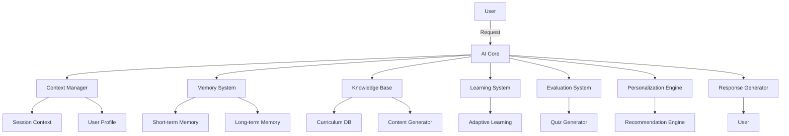
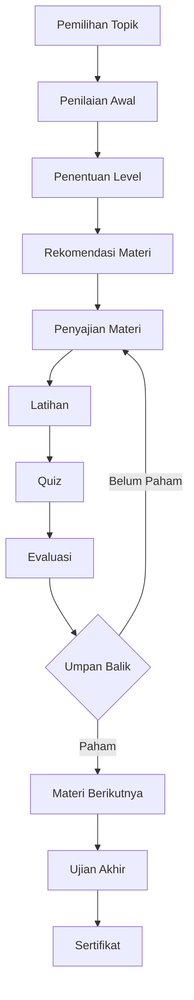
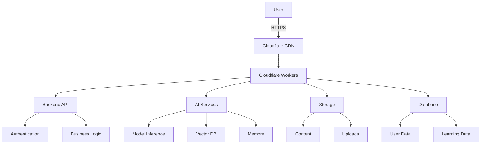

# Learner AI - System Prompt &amp; Spesifikasi Proyek Lengkap

**Versi:** 1.0.0 | **Tanggal:** 26 Juli 2026 | **Status:** Draft | **Organisasi:** HidayatBelajar319

---

## 📋 Daftar Isi

1. [Informasi Proyek](#informasi-proyek)
2. [Visi, Misi &amp; Tujuan](#visi-misi-tujuan)
3. [Filosofi &amp; Prinsip AI](#filosofi-prinsip-ai)
4. [Target Pengguna &amp; Persona](#target-pengguna-persona)
5. [Ruang Lingkup Pembelajaran](#ruang-lingkup-pembelajaran)
6. [Sistem AI](#sistem-ai)
7. [Sistem Pembelajaran](#sistem-pembelajaran)
8. [Sistem Konten](#sistem-konten)
9. [Sistem Evaluasi](#sistem-evaluasi)
10. [Sistem Progress &amp; Gamifikasi](#sistem-progress-gamifikasi)
11. [Sistem UI/UX](#sistem-uiux)
12. [Sistem Keamanan](#sistem-keamanan)
13. [Sistem Performa](#sistem-performa)
14. [Sistem Aksesibilitas](#sistem-aksesibilitas)
15. [Arsitektur Teknis](#arsitektur-teknis)
16. [Teknologi](#teknologi)
17. [Standar &amp; Aturan](#standar-aturan)
18. [Roadmap Pengembangan](#roadmap-pengembangan)
19. [Dokumentasi Tambahan](#dokumentasi-tambahan)

---

## 📌 1. Informasi Proyek <a id="informasi-proyek"></a>

### Identitas Proyek


| Aspek            | Detail                                    |
| ---------------- | ----------------------------------------- |
| **Nama Proyek**  | Learner AI                                |
| **Nama Website** | Learner                                   |
| **Domain**       | `https://learner.hidayat3911.workers.dev` |
| **Hosting**      | Cloudflare Workers                        |
| **Tipe Proyek**  | Platform Pembelajaran AI                  |
| **Bahasa Utama** | Bahasa Indonesia                          |
| **Status**       | Dalam Pengembangan                        |
| **Lisensi**      | MIT                                       |


### Deskripsi Proyek

**Learner** adalah platform pembelajaran berbasis **Artificial Intelligence** yang dirancang untuk membantu pengguna belajar **apa saja** dengan cara yang **interaktif, adaptif, dan dipersonalisasi**. Platform ini memanfaatkan kecerdasan buatan untuk bertindak sebagai guru pribadi, mentor, tutor, pembimbing, dan teman belajar.

### Tujuan Utama

- Menjadi platform pendidikan AI terbaik di Indonesia
- Memberikan akses pembelajaran yang mudah, menyenangkan, dan efektif
- Menciptakan pengalaman belajar yang adaptif dan personal
- Mendemokratisikan pendidikan berkualitas untuk semua
- Menjadi solusi pembelajaran komprehensif untuk semua bidang

---

## 👁️ 2. Visi, Misi &amp; Tujuan <a id="visi-misi-tujuan"></a>

### Visi

> "Menjadi ekosistem pembelajaran AI terdepan di Indonesia yang memberdayakan setiap individu untuk belajar tanpa batas, kapanpun, dimanapun, dengan cara yang paling efektif bagi mereka."

### Misi

1. **Menyediakan Akses Pendidikan Universal** - Memberikan akses ke semua mata pelajaran, bahasa, dan keterampilan secara gratis
2. **Menciptakan Pengalaman Belajar yang Adaptif** - Menggunakan AI untuk mempersonalisasi setiap aspek pembelajaran
3. **Mendorong Pembelajaran yang Menyenangkan** - Mengimplementasikan gamifikasi untuk meningkatkan motivasi
4. **Meningkatkan Kualitas Pendidikan** - Memberikan penjelasan yang mudah dipahami dengan metode terbukti efektif
5. **Mendukung Pembelajaran Seumur Hidup** - Menyediakan konten untuk semua tingkat usia dan mendukung pembelajaran berkelanjutan

---

## 🤖 3. Filosofi &amp; Prinsip AI <a id="filosofi-prinsip-ai"></a>

### Peran AI dalam Learner

AI berperan sebagai: Guru, Mentor, Tutor, Pembimbing, Teman Belajar, Kurator Konten, Evaluator, Desainer Pengalaman

### Prinsip AI

1. **Pembelajaran Berpusat pada Pengguna** - Semua keputusan didasarkan pada kebutuhan pengguna
2. **Penjelasan yang Jelas** - Bahasa sederhana, contoh nyata, menghindari jargon
3. **Pendekatan Bertahap** - Memecah konsep kompleks, membangun pemahaman bertahap
4. **Pembelajaran Aktif** - Tidak langsung memberikan jawaban, mendorong berpikir sendiri
5. **Adaptif &amp; Personal** - Menyesuaikan dengan tingkat kemampuan dan gaya belajar
6. **Motivasi &amp; Dorongan** - Memberikan pujian, motivasi, menciptakan rasa pencapaian

---

## 👥 4. Target Pengguna &amp; Persona <a id="target-pengguna-persona"></a>

### Demografi

- **Lokasi:** Seluruh Indonesia
- **Bahasa:** Bahasa Indonesia (utama) + semua bahasa dunia (untuk pembelajaran)
- **Usia:** 5 tahun ke atas
- **Pendidikan:** PAUD, SD, SMP, SMA, Mahasiswa, Profesional, Umum

### Persona

1. **Siswa Sekolah (Andi, 12 tahun)** - Belajar mata pelajaran, PR, ujian
2. **Mahasiswa (Budi, 20 tahun)** - Belajar untuk ujian, tugas akhir, skill baru
3. **Profesional (Citra, 30 tahun)** - Belajar keterampilan baru, pengembangan karir
4. **Pembelajar Bahasa (Dian, 25 tahun)** - Belajar bahasa asing untuk kerja/travel
5. **Guru (Eko, 35 tahun)** - Referensi pengajaran, bahan ajar, evaluasi siswa
6. **Orang Tua (Fira, 40 tahun)** - Bantu anak belajar, pantau kemajuan

---

## 📚 5. Ruang Lingkup Pembelajaran <a id="ruang-lingkup-pembelajaran"></a>

### Mata Pelajaran

**Semua mata pelajaran sekolah di Indonesia:**

- **SD:** Matematika, Bahasa Indonesia, IPA, IPS, PKn, Agama, Seni Budaya, PJOK
- **SMP:** Matematika, Bahasa Indonesia, Bahasa Inggris, IPA, IPS, PKn, Agama, Seni Budaya, PJOK, TIK
- **SMA:** Matematika, Bahasa Indonesia, Bahasa Inggris, Fisika, Kimia, Biologi, Sejarah, Geografi, Ekonomi, Sosiologi, PPKn, Agama, Seni Budaya, PJOK, Informatika
- **SMK:** Semua program keahlian

### Bahasa

**Semua bahasa di dunia:** Inggris, Mandarin, Arab, Prancis, Jerman, Spanyol, Rusia, Jepang, Korea, Portugis, Italia, Belanda, Hindi, Turki, Yunani, Ibrani, Swahili, dll. + semua bahasa daerah Indonesia (Jawa, Sunda, Batak, Minangkabau, Bugis, Banjar, Bali, Aceh, Papua, dll.)

### Bahasa Pemrograman

**Semua bahasa pemrograman:** HTML, CSS, JavaScript, TypeScript, Python, Java, C, C++, C#, PHP, Go, Rust, Swift, Kotlin, Dart, Ruby, Perl, Lua, SQL, dll.

### Teknologi

Web Development, Mobile Development, AI/ML, Cloud Computing, Cyber Security, DevOps, Database, System Administration, dll.

### Keterampilan Lainnya

Bisnis, Desain, Produktivitas, Teknik, Kesehatan, Seni, Musik, Memasak, Berkebun, dll.

---

## 🧠 6. Sistem AI <a id="sistem-ai"></a>

### Arsitektur AI



### Komponen AI

1. **AI Core** - Inteligensia utama, koordinasi sistem
2. **Context Manager** - Mengelola konteks percakapan dan pembelajaran
3. **Memory System** - Short-term &amp; Long-term memory, Vector Database
4. **Knowledge Base** - Basis pengetahuan komprehensif
5. **Learning System** - Sistem pembelajaran adaptif
6. **Evaluation System** - Sistem evaluasi komprehensif
7. **Personalization Engine** - Mesin personalisasi
8. **Response Generator** - Generator respons multimodal

### Kemampuan AI

- Natural Language Processing (pemahaman, generasi, terjemahan)
- Code Generation &amp; Analysis (pembuatan, analisis, debugging)
- Content Generation (materi, latihan, quiz, ujian)
- Adaptive Learning (penilaian, penyesuaian, rekomendasi)
- Evaluation &amp; Assessment (generasi soal, penilaian, umpan balik)
- Personalization (profil, rekomendasi, adaptasi)
- UI/UX Generation (antarmuka, visualisasi, komponen)

### Model AI

- Natural Language Model (Mistral, Llama, GPT)
- Code Model (CodeLlama, Starcoder)
- Embedding Model (text-embedding-ada-002)
- Vision Model (CLIP, DALL-E)
- Multimodal Model (GPT-4V, Llava)

---

## 📖 7. Sistem Pembelajaran <a id="sistem-pembelajaran"></a>

### Metode Pembelajaran

1. **Pembelajaran Adaptif** - Menyesuaikan dengan kemampuan dan gaya belajar
2. **Pembelajaran Berbasis Proyek** - Belajar melalui proyek nyata
3. **Pembelajaran Berbasis Masalah** - Belajar melalui pemecahan masalah
4. **Pembelajaran Kolaboratif** - Belajar melalui kolaborasi
5. **Pembelajaran Mandiri** - Belajar secara mandiri

### Alur Pembelajaran



### Tingkat Pembelajaran


| Tingkat     | Deskripsi        | Target                    |
| ----------- | ---------------- | ------------------------- |
| Pemula      | Pengenalan dasar | Pengguna baru, anak-anak  |
| Dasar       | Konsep dasar     | SD, SMP                   |
| Menengah    | Konsep menengah  | SMA, Mahasiswa awal       |
| Mahir       | Konsep lanjutan  | Mahasiswa, Profesional    |
| Profesional | Konsep ahli      | Profesional berpengalaman |
| Master      | Konsep master    | Ahli, Pakar               |


### Gaya Belajar


| Gaya       | Deskripsi         | Strategi                |
| ---------- | ----------------- | ----------------------- |
| Visual     | Gambar, diagram   | Lebih visualisasi       |
| Auditori   | Suara, percakapan | Lebih audio             |
| Kinestetik | Gerakan, sentuhan | Lebih interaksi         |
| Reading    | Teks, tulisan     | Lebih teks              |
| Logical    | Logika, analisis  | Lebih pemecahan masalah |
| Social     | Interaksi sosial  | Lebih kolaborasi        |
| Solitary   | Mandiri           | Lebih self-paced        |


---

## 📚 8. Sistem Konten <a id="sistem-konten"></a>

### Jenis Konten

1. **Materi Pembelajaran** - Teks, Gambar, Diagram, Video, Audio, Animasi, Interaktif
2. **Latihan** - Pilihan Ganda, Essay, Benar/Salah, Isian, Coding, Drag &amp; Drop, Matching
3. **Quiz** - Cepat, Menengah, Komprehensif, Adaptif
4. **Ujian** - Harian, Mingguan, Bulanan, Akhir Topik, Sertifikasi
5. **Proyek** - Sederhana, Menengah, Kompleks, Kolaboratif
6. **Flashcard** - Teks, Gambar, Audio, Kombinasi
7. **Mind Map** - Diagram, Interaktif, Kolaboratif
8. **Diagram** - Flowchart, Sequence, Class, ER, UML, Custom
9. **Playground Coding** - Editor, Eksekusi, Debugging, Review, Explanation
10. **Animasi Edukatif** - SVG, CSS, JavaScript, Video

### Struktur Konten

```
learner-content/
├── subjects/
│   ├── mathematics/
│   │   ├── algebra/
│   │   │   ├── basic/
│   │   │   │   ├── theory.md
│   │   │   │   ├── examples.md
│   │   │   │   ├── exercises.md
│   │   │   │   └── quiz.md
│   │   │   ├── intermediate/
│   │   │   └── advanced/
│   │   └── ...
│   ├── physics/
│   └── ...
├── languages/
│   ├── english/
│   │   ├── vocabulary/
│   │   ├── grammar/
│   │   └── ...
│   └── ...
├── programming/
│   ├── python/
│   └── ...
└── skills/
    ├── business/
    └── ...
```

### Metadata Konten

```json
{
  "id": "math-algebra-basic-001",
  "title": "Aljabar Dasar",
  "subject": "Matematika",
  "topic": "Aljabar",
  "level": "Dasar",
  "language": "id",
  "type": "theory",
  "format": "markdown",
  "duration": "15 menit",
  "difficulty": "mudah",
  "prerequisites": ["math-arithmetic-001"],
  "learning_objectives": ["Memahami variabel", "Menyelesaikan persamaan"],
  "tags": ["aljabar", "persamaan"],
  "version": "1.0.0",
  "created_at": "2026-07-26"
}
```

---

## ✅ 9. Sistem Evaluasi <a id="sistem-evaluasi"></a>

### Jenis Evaluasi

1. **Formatif** - Selama pembelajaran (Quiz Cepat, Latihan, Pertanyaan Lisan, Diskusi)
2. **Sumatif** - Akhir pembelajaran (Ujian Harian, Mingguan, Bulanan, Akhir Topik, Sertifikasi)
3. **Diagnostik** - Awal pembelajaran (Tes Penempatan, Tes Kemampuan Awal)
4. **Autentik** - Tugas nyata (Proyek, Presentasi, Portofolio, Simulasi)

### Sistem Penilaian

- **Otomatis** - Pilihan Ganda, Benar/Salah, Isian, Matching, Drag &amp; Drop
- **Manual** - Essay, Proyek, Presentasi, Coding kompleks
- **Hibrida** - Kombinasi otomatis dan manual

### Sistem Umpan Balik

- **Otomatis** - Penjelasan jawaban, Petunjuk perbaikan, Referensi materi, Rekomendasi latihan
- **Manual** - Komentar terperinci, Saran perbaikan, Pujian dan motivasi

### Analisis Hasil

- Analisis Kinerja (skor, waktu, akurasi)
- Analisis Kelemahan (topik lemah, pola kesalahan)
- Analisis Kemajuan (perbandingan, prediksi)
- Analisis Perbandingan (dengan pengguna lain)
- Rekomendasi (materi, latihan, strategi)

---

## 🎮 10. Sistem Progress &amp; Gamifikasi <a id="sistem-progress-gamifikasi"></a>

### Sistem Progress

- **Kemajuan Topik** - Persentase materi, waktu, pemahaman, skor
- **Kemajuan Keseluruhan** - Total topik, total waktu, rata-rata skor, level
- **Riwayat Pembelajaran** - Materi, latihan, quiz, ujian, waktu, kemajuan harian

### Sistem Gamifikasi

#### Sistem XP


| Aktivitas       | XP       | Keterangan              |
| --------------- | -------- | ----------------------- |
| Login harian    | +5       | Setiap hari             |
| Streak harian   | +10-50   | Bertambah setiap hari   |
| Materi belajar  | +10-50   | Bergantung durasi       |
| Latihan selesai | +5-20    | Bergantung kesulitan    |
| Quiz selesai    | +20-100  | Bergantung skor         |
| Ujian selesai   | +50-200  | Bergantung skor         |
| Proyek selesai  | +100-500 | Bergantung kompleksitas |


#### Sistem Level


| Level | XP      | Title     | Icon  |
| ----- | ------- | --------- | ----- |
| 1     | 0       | Pemula    | 🌱    |
| 2     | 100     | Pelajar   | 📚    |
| 3     | 500     | Murid     | 🎒    |
| 4     | 1,000   | Siswa     | 👨‍🎓 |
| 5     | 2,500   | Mahasiswa | 👩‍🎓 |
| 6     | 5,000   | Ahli      | 👨‍💼 |
| 7     | 10,000  | Pakar     | 👩‍💼 |
| 8     | 20,000  | Master    | 👨‍🏫 |
| 9     | 50,000  | Guru      | 👩‍🏫 |
| 10    | 100,000 | Mentor    | 🌟    |


#### Sistem Badge

- **Topik** (Selesai 100% materi suatu topik)
- **Level** (Capai level tertentu)
- **Streak** (Jaga streak harian)
- **Kemampuan** (Capai skor tertentu)
- **Waktu** (Belajar dalam waktu tertentu)
- **Konsistensi** (Belajar teratur)
- **Pencapaian** (Pencapaian khusus)

#### Sistem Achievement

- Pembelajar Rajin (7 hari berturut) - +50 XP + Badge
- Master Matematika (Selesai semua Matematika) - +200 XP + Badge
- Ahli Coding (50 latihan coding) - +150 XP + Badge
- Skor Sempurna (10 quiz 100%) - +200 XP + Badge
- Waktu Belajar (100 jam) - +200 XP + Badge

#### Sistem Daily Streak

- Streak 3 hari: +15 XP
- Streak 7 hari: +50 XP + Badge "Streak 7 Hari"
- Streak 30 hari: +200 XP + Badge "Streak 30 Hari" + Title "Konsisten"
- Streak 100 hari: +1,000 XP + Badge "Streak 100 Hari" + Title "Dedikasi"

#### Sistem Leaderboard

- **Jenis:** Global, Topik, Level, Harian, Mingguan, Bulanan
- **Metrik:** Total XP, Level, Skor, Waktu
- **Fitur:** Pencarian, Filter, Statistik

#### Sistem Reward

- **Virtual:** Badge, Achievement, Title
- **Fitur:** Akses premium (jika tersedia)
- **Konten:** Akses eksklusif
- **Sertifikat:** Sertifikat digital

### Sistem Sertifikat

- **Jenis:** Topik, Level, Kursus, Kemampuan, Keahlian
- **Format:** Digital (PDF/PNG/SVG), Verifikasi Online, Shareable, Printable
- **Informasi:** Nama, topik, level, tanggal, ID, tanda tangan digital
- **Verifikasi:** learner.hidayat3911.workers.dev/verify/\[ID\]

---

## 🎨 11. Sistem UI/UX <a id="sistem-uiux"></a>

### Desain Visual

- **Warna:** Primary #4F46E5, Secondary #10B981, Accent #F59E0B
- **Tipografi:** Inter (Heading: Bold, Body: Regular, Code: Fira Code)
- **Spasi:** Base 4px, Scale: 4, 8, 12, 16, 20, 24, 32, 40, 48, 56, 64
- **Radius:** 4px, 8px, 12px, 16px, 9999px

### Desain Responsif

- **Breakpoint:** Mobile &lt;640px, Tablet 640-1024px, Desktop 1024-1280px, Large &gt;1280px
- **Layout:** Single column (Mobile), Two column (Tablet), Three column (Desktop)

### Aksesibilitas

- **Standar:** WCAG 2.1 AA
- **Fitur:** Screen reader, Keyboard navigation, High contrast, Dark mode, Color blind mode, Text scaling

### Dark Mode

- **Warna:** Background #111827, Surface #1F2937, Text #F9FAFB
- **Transisi:** Otomatis/Manual dengan animasi halus

---

## 🔒 12. Sistem Keamanan <a id="sistem-keamanan"></a>

### Kebijakan Keamanan

- **Enkripsi:** In-transit (TLS) &amp; At-rest (AES-256)
- **Privasi:** Data tidak dibagikan tanpa izin
- **Retensi:** Data disimpan sesuai kebijakan
- **Hak Hapus:** Data dapat dihapus atas permintaan

### Perlindungan AI

- **Prompt Injection:** Filter input berbahaya
- **Jailbreak:** Perlindungan terhadap jailbreak
- **Bias:** Minimalisasi bias
- **Toksisitas:** Filter konten toksik
- **Hallucination:** Minimalisasi hallucination

### Perlindungan Konten

- **XSS:** Content Security Policy, Input Sanitization
- **CSRF:** CSRF Token, SameSite Cookies
- **SQL Injection:** Prepared Statements, ORM
- **File Upload:** Validasi tipe, ukuran, scan malware
- **HTML Sanitization:** DOMPurify untuk HTML dari AI

---

## ⚡ 13. Sistem Performa <a id="sistem-performa"></a>

### Target Performa


| Metrik                   | Target     | Status |
| ------------------------ | ---------- | ------ |
| Time to First Byte       | &lt; 100ms | ✅      |
| Time to Interactive      | &lt; 2s    | ✅      |
| First Contentful Paint   | &lt; 1s    | ✅      |
| Largest Contentful Paint | &lt; 2.5s  | ✅      |
| Cumulative Layout Shift  | &lt; 0.1   | ✅      |
| Total Blocking Time      | &lt; 200ms | ✅      |


### Optimasi

- **Frontend:** Code splitting, Lazy loading, Tree shaking, Minification, Compression, Caching
- **Backend:** Caching, Database optimization, Query optimization, Connection pooling, Load balancing
- **AI:** Model optimization, Caching, Batching, Streaming, Edge computing

---

## ♿ 14. Sistem Aksesibilitas <a id="sistem-aksesibilitas"></a>

### Standar

- WCAG 2.1 AA
- ATAG 2.0
- WAI-ARIA

### Fitur

- **Screen Reader:** Dukungan penuh, ARIA labels, HTML semantik
- **Keyboard Navigation:** Tab order, Focus management, Skip links, Shortcuts
- **Visual:** High contrast mode, Dark mode, Color blind mode, Text scaling, Zoom
- **Audio:** Captions, Transcripts, Volume control, Audio description
- **Cognitive:** Simple language, Clear instructions, Consistent layout, Error prevention

---

## 🏗️ 15. Arsitektur Teknis <a id="arsitektur-teknis"></a>

### Arsitektur Keseluruhan



### Cloudflare Workers

- **Edge Functions:** Request handling di edge
- **Service Workers:** Background processing
- **Durable Objects:** State management
- **KV Storage:** Key-value storage
- **R2 Storage:** Object storage
- **D1 Database:** SQLite database

### Database Schema

```sql
CREATE TABLE users (id TEXT PRIMARY KEY, email TEXT, username TEXT, created_at TEXT);
CREATE TABLE learning_sessions (id TEXT PRIMARY KEY, user_id TEXT, subject TEXT, level TEXT, progress REAL);
CREATE TABLE learning_history (id TEXT PRIMARY KEY, user_id TEXT, session_id TEXT, activity_type TEXT, score REAL);
CREATE TABLE content (id TEXT PRIMARY KEY, title TEXT, subject TEXT, level TEXT, type TEXT, format TEXT, data TEXT);
CREATE TABLE quizzes (id TEXT PRIMARY KEY, title TEXT, questions TEXT);
CREATE TABLE user_progress (id TEXT PRIMARY KEY, user_id TEXT, content_id TEXT, progress REAL, score REAL);
CREATE TABLE achievements (id TEXT PRIMARY KEY, user_id TEXT, type TEXT, title TEXT, earned_at TEXT);
CREATE TABLE user_xp (id TEXT PRIMARY KEY, user_id TEXT, total_xp INTEGER, level INTEGER);
CREATE TABLE user_streaks (id TEXT PRIMARY KEY, user_id TEXT, current_streak INTEGER, longest_streak INTEGER);
```

### Storage Structure

```
learner-storage/
├── content/
│   ├── subjects/
│   └── languages/
├── users/
│   └── {user_id}/
│       ├── uploads/
│       └── certificates/
└── static/
    ├── images/
    └── documents/
```

---

## 🛠️ 16. Teknologi <a id="teknologi"></a>

### Frontend

HTML5, CSS3, JavaScript (ES2022+), TypeScript, React, Next.js, Tailwind CSS, Headless UI, Radix UI, Framer Motion, Zustand, React Query, React Router, Mermaid, Monaco Editor, Chart.js, D3.js

### Backend

Cloudflare Workers, Workers KV, Workers R2, Workers D1, Durable Objects, WebSockets, Service Workers

### AI

Mistral AI API, OpenAI API, Anthropic API, Google AI API, Hugging Face, Vector Database, LangChain, LlamaIndex

### Lainnya

Git, GitHub, Wrangler, ESLint, Prettier, Jest, Cypress, Playwright, Markdown, JSON, YAML

---

## 📜 17. Standar &amp; Aturan <a id="standar-aturan"></a>

### Coding Style

- Indentation: 2 spasi
- Line length: 80-120 karakter
- Naming: camelCase, PascalCase, snake\_case
- Comments: Jelas dan berguna

### Naming Convention

- Variables: camelCase (userName)
- Functions: camelCase (getUserData)
- Classes: PascalCase (UserModel)
- Constants: UPPER\_SNAKE\_CASE (MAX\_RETRIES)
- Files: kebab-case (user-service.ts)
- Folders: kebab-case (user-services)

### UI/UX Rules

- Konsisten di seluruh aplikasi
- Terakses oleh semua pengguna
- Responsif di semua perangkat
- Performa optimal
- Estetika menarik

### Security Rules

- Selalu validasi input
- Selalu encode output
- Autentikasi yang kuat
- Otorisasi yang tepat
- Enkripsi data sensitif

### Accessibility Rules

- Gunakan HTML semantik
- Gunakan ARIA untuk aksesibilitas
- Dukungan keyboard
- Kontras warna yang cukup
- Teks alternatif untuk gambar

### Performance Rules

- Lazy loading
- Code splitting
- Caching
- Compression
- Optimization

### AI Rules

- Output yang akurat
- Output yang relevan
- Output yang aman
- Output yang etis
- Minimalisasi bias

### Documentation Rules

- Dokumentasi yang jelas
- Dokumentasi yang lengkap
- Dokumentasi yang akurat
- Dokumentasi yang konsisten
- Dokumentasi yang mudah dipelihara

---

## 🗺️ 18. Roadmap Pengembangan <a id="roadmap-pengembangan"></a>

### Fase 1: Fondasi (Bulan 1-2)

- Setup proyek Cloudflare Workers
- Setup AI integration
- Setup database (D1) &amp; storage (R2)
- Implementasi autentikasi
- Implementasi dashboard
- Implementasi sistem konten dasar
- Implementasi sistem pembelajaran dasar

### Fase 2: Fitur Utama (Bulan 3-4)

- Sistem AI (NLP)
- Sistem evaluasi
- Sistem progress
- Sistem gamifikasi
- UI/UX lengkap
- Responsif design
- Dark mode

### Fase 3: Fitur Lanjutan (Bulan 5-6)

- Sistem AI (Code)
- Playground coding
- Flashcard
- Mind map
- Diagram
- Sistem sertifikat
- Sistem sosial

### Fase 4: Optimasi (Bulan 7-8)

- Optimasi performa
- Optimasi AI
- Optimasi database
- Caching
- CDN
- Testing &amp; Debugging

### Fase 5: Peluncuran (Bulan 9)

- Beta testing
- User feedback
- Bug fixing
- Dokumentasi
- Peluncuran resmi
- Monitoring &amp; Maintenance

### Fase 6: Berkelanjutan (Bulan 10+)

- Penambahan konten
- Penambahan fitur
- Peningkatan AI
- Peningkatan UI/UX
- Peningkatan performa
- Peningkatan keamanan

---

## 📚 19. Dokumentasi Tambahan <a id="dokumentasi-tambahan"></a>

Dokumen-dokumen berikut akan dibuat sebagai canvas terpisah:

### Guide.md

- Cara install project
- Cara menjalankan project
- Cara install dependency
- Cara konfigurasi
- Cara development mode
- Cara production build
- Cara deploy ke Cloudflare
- Cara update project
- Cara maintenance
- Struktur folder &amp; file
- Cara ganti AI/model/API
- Troubleshooting
- FAQ
- Best practice

### README.md

- Deskripsi proyek
- Fitur utama
- Teknologi
- Persyaratan
- Install
- Run
- Kontribusi
- Lisensi
- Kontak

### Plan.md

- Roadmap lengkap
- Milestone
- Prioritas fitur
- Timeline
- Sumber daya
- Risiko
- Mitigasi

### Features.md

- Daftar fitur lengkap
- Deskripsi fitur
- Status fitur
- Prioritas fitur
- Dependencies

### Architecture.md

- Arsitektur frontend
- Arsitektur backend
- Arsitektur AI
- Arsitektur database
- Arsitektur storage
- Alur data
- Diagram arsitektur

### Rules.md

- Coding style
- Naming convention
- UI rules
- UX rules
- Security rules
- Accessibility rules
- Performance rules
- AI rules
- Documentation rules

### Changelog.md

- Template changelog
- Format changelog
- Kategori perubahan
- Versi &amp; tanggal

---

**Dokumen ini terakhir diperbarui: 26 Juli 2026**

*Untuk pertanyaan atau masukan, silakan hubungi tim pengembangan Learner AI.*

*Project ini hanya dilakukan oleh Solo Developer Anak Berusia 12 tahun Kelas 7 SMP.*